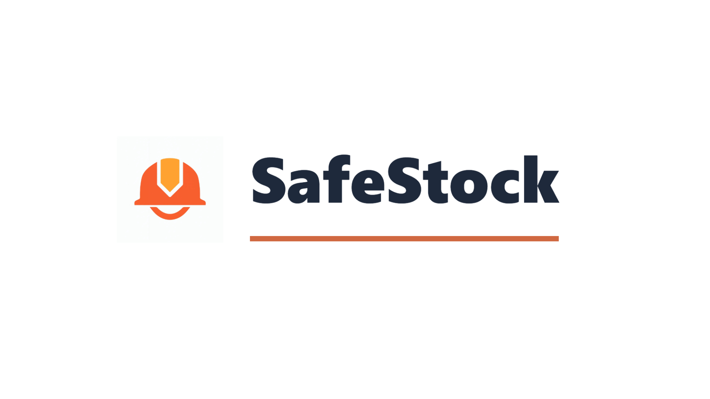

# Hola, soy David Emmanuel Cardozo 👋

### Desarrollador de Software

Soy Técnico Universitario en Desarrollo de Software con base en **Argentina**. Me especializo en el ecosistema **PHP y Laravel** , enfocado en crear soluciones funcionales, código limpio y la aplicación de buenas prácticas.

---

## 🛠️ Stack Tecnológico

---

## 🚀 Proyecto Destacado: Safe Stock

He contribuido activamente en el desarrollo del **Sistema de Gestión de Recursos y Seguridad en talleres y obras**.

* **Repositorio del Proyecto:** [Sistema de Gestión de recursos y Seguridad](https://github.com/Jalifimaia/Sistema-de-Gestion-de-recursos-y-Seguridad-en-talleres-y-obras)
* **Terminal Interactiva:** Implementé una terminal con reconocimiento de voz para la gestión autónoma de préstamos.
* **Seguridad:** Desarrollo de inicio de sesión mediante códigos QR, DNI y claves personalizadas.
* **Gestión de Herramientas:** Registro y devolución mediante escaneo QR y exportación masiva de reportes a PDF.
* **Calidad de Código:** Aplicación de tests unitarios en procesos críticos y refactorización integral.

---

## Demo en YouTube

---

## 📫 Contacto

